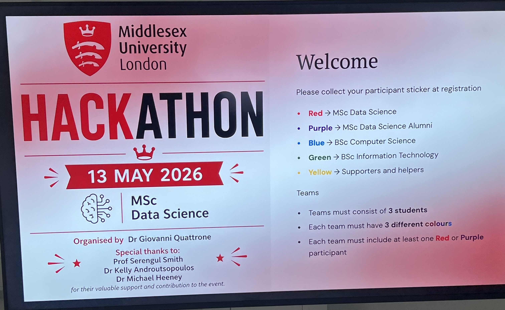
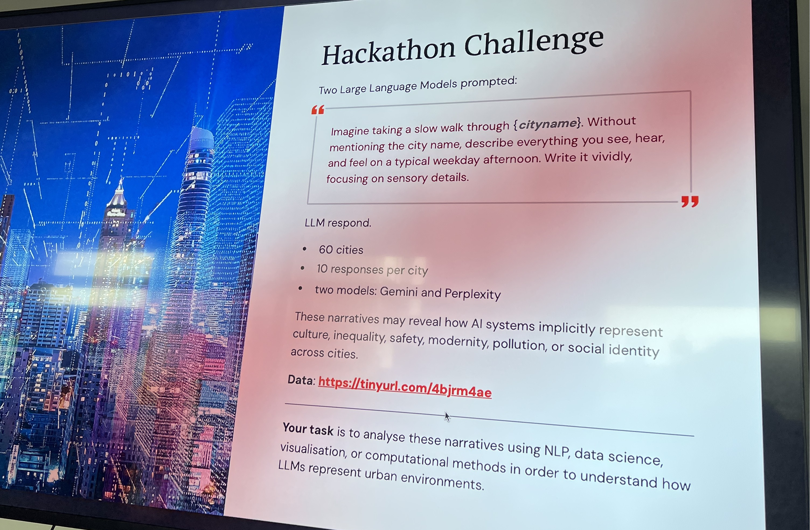
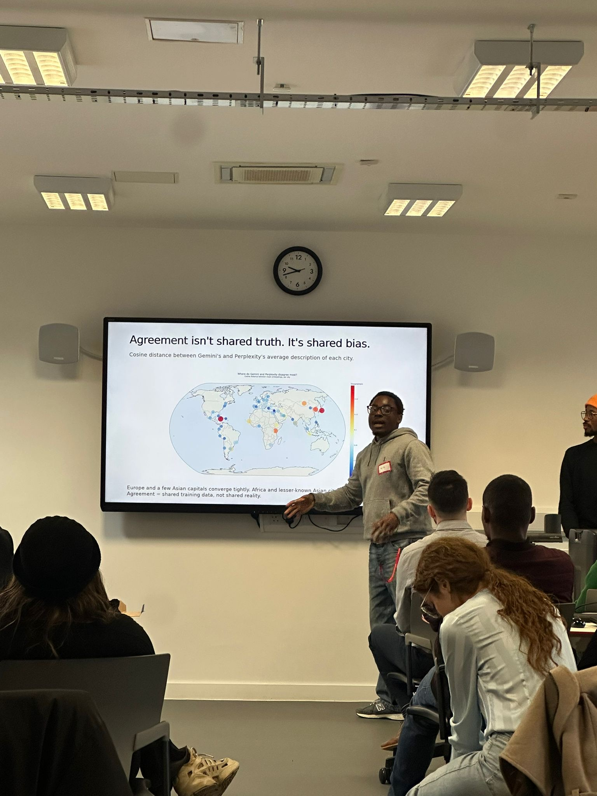
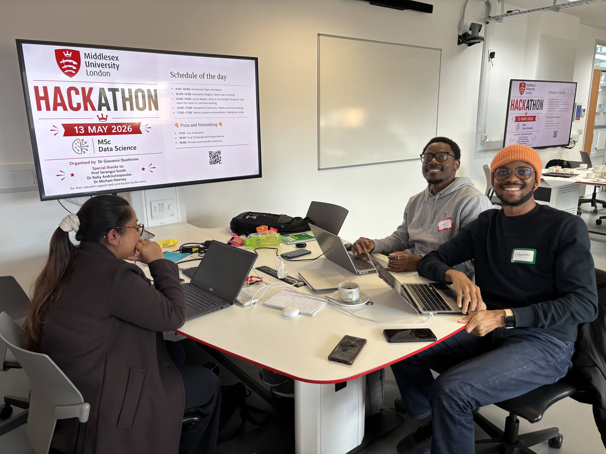
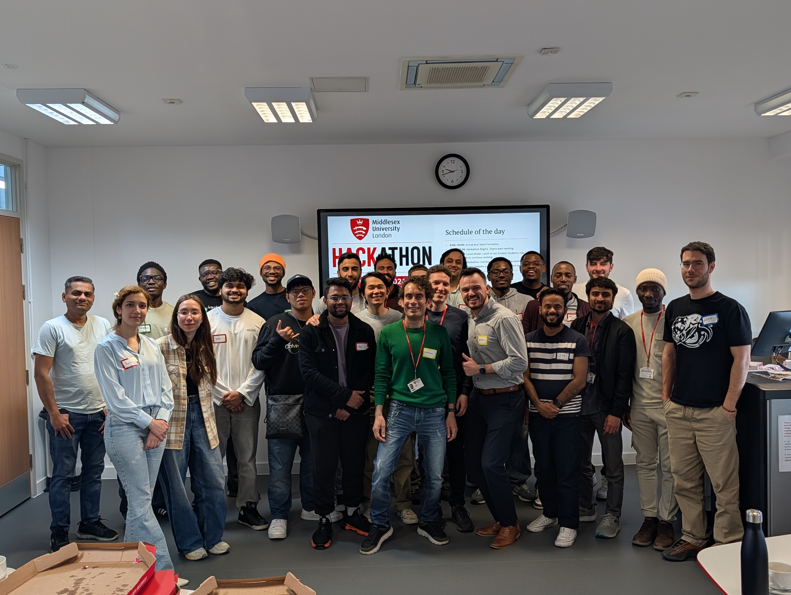

During the start of my second semester, our module leader announced a hackathon as part of reinforcing our learnings and for networking as well. Well, as for me, you will always find me where there's a learning opportunity so I registered to participate. Since I study data science, I had a rough dea of what to expect. 

Truth be told, I wasn't nervous at all because what's the worst that can happen? I would just learn and have fun, right?

On the day of the hackathon, teams were created and I was in a team with 3 other people (teams must consist of at least one person from a different course).

{fig-cap="Hackathon team formation criteria"}

#### **The Challenge:**
The core challenge is:

> **Use NLP, machine learning, visualisation, and critical thinking to analyse how Large Language Models (Gemini and Perplexity) “see” and describe cities and uncover what these descriptions reveal about urban identity, stereotypes, emotions, and bias.**

It’s about interpreting AI‑generated narratives and understanding what they say about culture, geography, inequality, safety, emotions, stereotypes, urban life and then communicating those insights clearly and creatively.

{fig-cap="Hackathon Challenge"}

I was lucky to be in a great team as we were able to tackle the problem together and come up with great insights. We all had a lot of fun working together and learning from each other. We made the top 3 that will get to present their solution in front of the whole students and panel. 
I'm exceptionally proud of what we achieved and the storytelling behind it as that was where our project really shined. 

I think we failed to win as other teams were more creative with their visual presentations but my team and I were more focused on the content and insights. Our analysis revealed clear differences in how Gemini and Perplexity described cities especially around emotion, safety, and stereotypes. 

Overall, it was a great experience and I learned a lot. One thing I really figured out was that I don't utilise AI enough but we live and we learn.  I would definitely participate in another hackathon in the future. It’s a great way to learn, network, and have fun.

You can view our presentation slides [here](hackathon_slides.pptx){target="_blank"}.

Here are some pictures from the day:

::: {.grid-2}
{fig-cap="Zimuzo presenting the project during the day of the hackathon"}

{fig-cap="Team picture during the presentation"}

{fig-cap="Team picture after the presentation"}
:::

Okay bye xx! 😍
