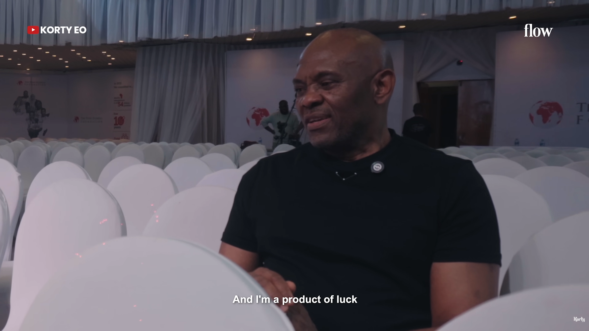

I think people bang on about hard work and the hustle to achieve success, but sometimes you just need a little bit of luck. I've been thinking about this a lot lately, especially after watching the YouTube video that [Korty](https://www.youtube.com/@kortyeo) made about Tony Elumelu. You can watch it [here](https://youtu.be/9sCbk_UYUvc?si=oFPi-78ysP2g5nbJ). He said, "At times you don't get successful because you're the best in class or because you're the fittest or because you're the most energetic. At times, you need luck, and I'm a product of luck." You see how much he highlighted the importance of luck in his success.

{fig-cap="Tony Elumelu with subtitle 'I'm a product of luck'"}

Disclaimer: I never said to stop working hard. 😂

Reflecting back on certain things in my life, I see how luck, or the lack of it, has played into certain aspects of my career. I must say I've been lucky in many ways, but this post is just an excuse to rant about the times I feel like I could have been luckier, especially in my career.

As someone just starting out in my career, my first example is my first internship, where I really wished for a contract extension but it didn't happen. Meanwhile, my mates who got internships around the same time as me ended up with contract extensions or found their way into other roles at their companies. What are the chances I didn't get that same luck, haha? It stings a little.

Don't get me started on the gruesome job search process. My friend Sam will always say you need luck, and I really agree. You get so much advice: apply within a few hours of the job being posted, always tailor your CV, get in touch with recruiters, network, network, network. Don't get me wrong, doing all of this definitely helps and is all good advice, but really and truly, it boils down to being lucky. What are the chances your CV gets picked out of the pile? What are the chances your application reaches the right person? What are the chances you get an interview? What are the chances the recruiter even gets back to you? Luck, maybe??

So, maybe next time you see someone in the job search process, ask them what they've already done instead of just throwing advice at them that they already know and have been following. Maybe, just maybe they need a little bit of luck to get through that phase.

Remember to keep putting in the work. I sometimes feel like I've lost all motivation, but while you're waiting for that luck to come, keep putting in the work anyway. You didn't come this far to just quit now lol. You never know when your luck will come knocking, so best be prepared for it. 

This last part sounds so cheesy...let me go touch grass abeg.😂 